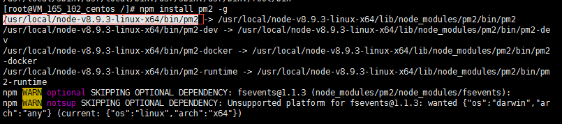

最近在公司用express写了几个接口程序，想要部署到服务器上面去。我写一下我部署的过程还有部署过程中遇到的一些问题。


这里的服务器是ubuntu系统，我这里使用的是root账户登录的服务器，你可以使用你自己的，并且给他赋予sudo权限。 

服务器已经配置好了node，npm环境， 并没有nginx

### 首先，我创建了一个文件夹用来放置项目文件（项目我命名为portal-server）。这里我是放在/var/www/portal-server下。

执行下面命令,进入项目目录

```
cd /var/www/portal-server
```

### 安装需要用到的npm包

```
npm install
```

**安装完毕之后，就可以运行`npm run start`启动项目， 但是有个问题，就是当我们关闭ssh客户端或者关闭当前连接的时候， 项目服务进程也会挂掉，我们需要让服务保持永久启动状态， 即使重启了服务器，也可以自己启动这个项目。**

这里就用到了一个pm2包。

pm2 是一个守护程序管理器，他帮助我们管理并且保持我们创建的应用程序始终在线。 

### 全局安装pm2

```
npm install pm2 -g
```

启动项目(我这里express项目的启动文件是server.js，你可以改成你自己的文件名，比如`pm2 start bashscript.sh`等)

```
pm2 start server.js
```

 pm2 start 命令还有一些参数：

```
 pm2 start env.js --watch --ignore-watch="node_modules"
 - --name<app_name> #指定app的名称
 - --watch  #监听项目有变化的时候重新启动项目
 - --max-memory-restart <200MB>  #app重新加载的内存阈值
 - --log <log_path> #设置日志打印目录
 - --restart-delay <delay in ms> #自动重启之间时间间隔
 - --no-autorestart #不要重启程序
 .....
```

pm2 进程管理命令：

```
pm2 restart server.js #重启
pm2 reload server.js #重新加载
pm2 stop server.js #暂停服务
pm2 delete server.js #删除服务
```
`pm2 restart all` 可以作用在重启所有进程
`pm2 restart id` 可以作用在指定id的进程，id可以使用 `pm2  [list|ls|status]` 获得 


pm2 日志管理操作：

```
pm2 logs #要实时显示日志
pm2 logs --lines 200 #查看更久的日志
pm2 flush  #清空所有日志
pm2 reloadLogs #重新加载所有日志

```
到这里我们就完成了项目的自动启动，还可以在项目文件有更新的时候实现重载。 

我们到浏览器输入ip:port访问项目，因为我们还没有域名，所以只能通过端口进行访问，如果你有就直接域名访问就好了。但是域名可能要做端口映射和域名解析，这里就先不说明了。

但是却访问不通，这是因为我们的这个项目是监听的5000端口，但是服务器却没有开通5000端口的访问权限。所以我们需要开通5000端口

### 开通项目监听端口

我们可以使用下面的命令来开通端口号

```
iptables -A INPUT -p tcp --dport 5000 -j ACCEPT
```

如果端口开放成功，你是可以通过telnet ip:port 调通的， 这个时候就可以访问项目了。


----------------------     这里是分隔线    ----------------------------

*问题列表*

1. 我们同一个项目部署了两台服务器，但是两台服务器的环境不一样。在安装pm2的时候，一个直接运行 `pm2 ls` 就可以执行，

 一个运行 `pm2 ls` 的时候却说  `command not found`

**说明，pm2没有配制到全局，虽然安装到了全局，但是linux下不像windows下能自动创造一个环境变量去实现我们的全局。所以我们需要创建一个linux下的软连接。**

### 创建软连接

这里将pm2的真实路径连接到linux的全局路径相当于 window下面创建环境变量。 要创建这个软连接 需要知道 **pm2的install的路径** 和 **linux的全局路径**

#### 查询linux全局路径

```
 echo $PATH
```
执行结果类似如下：


在上面的执行结果中，选择任意一个:为结尾的路径作为指定的linux全局路径， 例如/usr/local/sbin

### pm2全局安装路径

pm2的安装路径在 `pm2 i -g` 的时候可以看到，如下图：



**/usr/local/node-v8.9.3-linux-x64/bin/pm2** 这个就是pm2的安装路径

如果你之前已经安装过了pm2, 可以使用 `whereis app_name` 或 `find app_name` 命令去查找。

### 建立软连接

```
 ln -s /usr/local/node-v8.9.3-linux-x64/bin/pm2 /usr/local/sbin/  
```

建立成功之后，`pm2 list` 就可以执行了

[pm2文档](https://pm2.keymetrics.io/docs/usage/quick-start/)